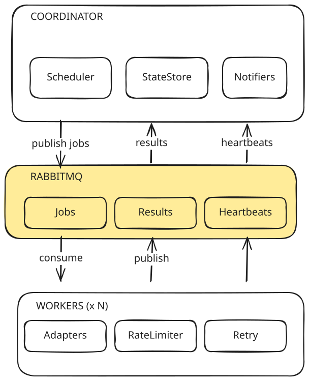

# Argus 

Argus is a distributed real-time monitoring and alerting platform that detects state changes across pluggable data sources and delivers notifications.

## Architecture
The coordinator schedules checks and publishes jobs to RabbitMQ. Workers consume
jobs, run the check through a specific adapter, and publish results back. 
The coordinator drains results, updates state, and alerts on definitive transitions. Workers remain stateless.

## Quick Start
1. Create a `.env` in the repo root:
    - `DISCORD_WEBHOOK_URL=https://discord.com/api/webhooks/...`

2. Configure products to monitor in `config/products.yaml`

3. Run the stack:
    - `docker compose up --build --scale worker=2`

4. Check on it:
    - `curl localhost:8080/health`     # liveness + uptime
    - `curl localhost:8080/status`     # per-product state, queue depth, worker heartbeats

RabbitMQ's management UI is at `localhost:15672` (guest/guest).

## Design Decisions
- **Single Writer Coordinator**: The coordinator is the only process that writes persistent state and sends notifications. Workers execute checks and return results.
- **`UNKOWN` as a non participatory status**: A failed or unparseable check returns `UNKNOWN`, which keeps the last definitive status in place and sits out transition detection.
- **Ack-after-publish**: A worker acknowledges a job only after publishing its result. Unacknowledged jobs are redelivered to another worker. Each dispatch carries a unique job ID, and the coordinator drops results for jobs it no longer tracks.
- **RabbitMQ for the message queue**: Provides delivery guarantees, acknowledgements, and re-delivery.
- **Per-source rate limiting with jitter**: Requests to the same site are spaced by a minimum interval plus random jitter, applied at both the scheduling and request layers.

